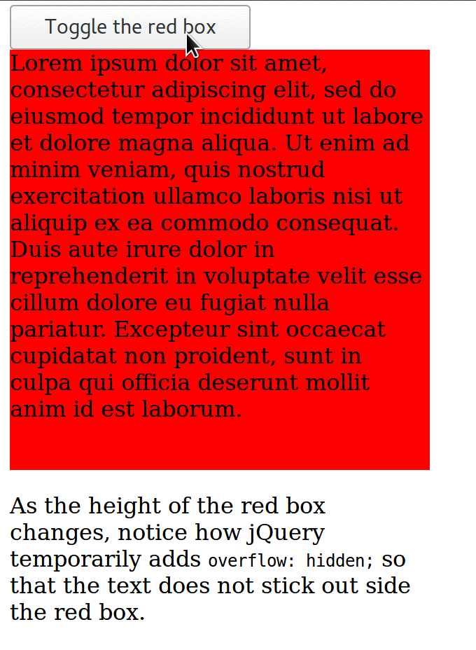
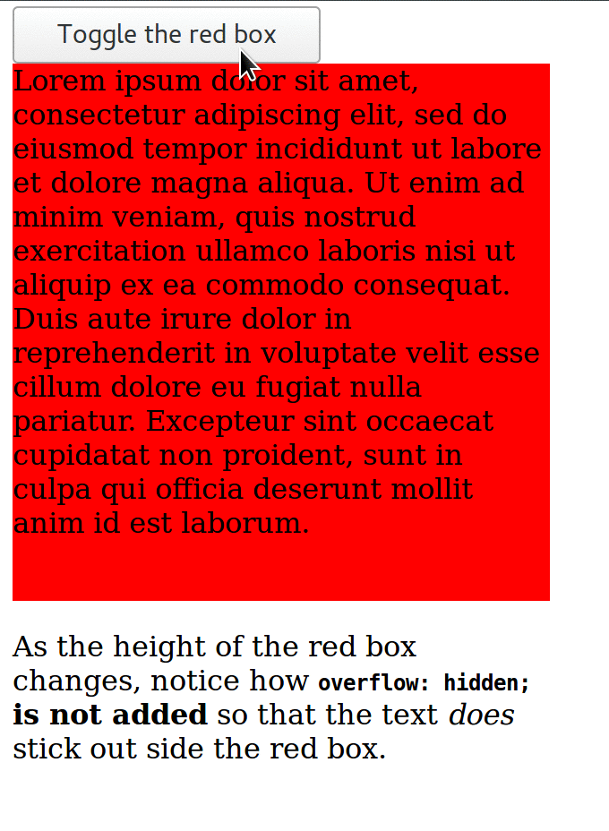

# babel-plugin-minify-dead-code-elimination bug demo

1. `npm install`
2. `npm run build`
3. `node minimal.js`
4. Open `pass.html` in a browser.
5. Open `fail.html` in a browser.
6. Open `fail-edit.html` in a browser.

Tip: To see the diff between input and output:

```
git diff --no-index jquery.input.js jquery.output.js
git diff --no-index jquery.input.js jquery.output-edit.js
```

You can see the output of those commands here:

- [jquery.diff](jquery.diff).
- [jquery-edit.diff](jquery-edit.diff).

## Expected behavior (before minify)



## Actual behavior (after minify)


